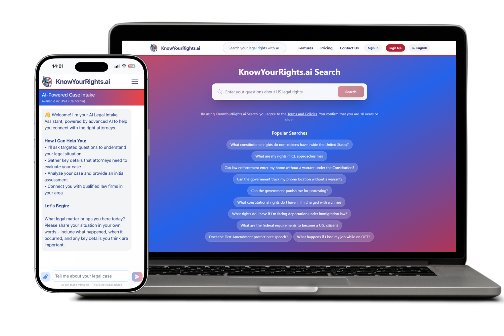
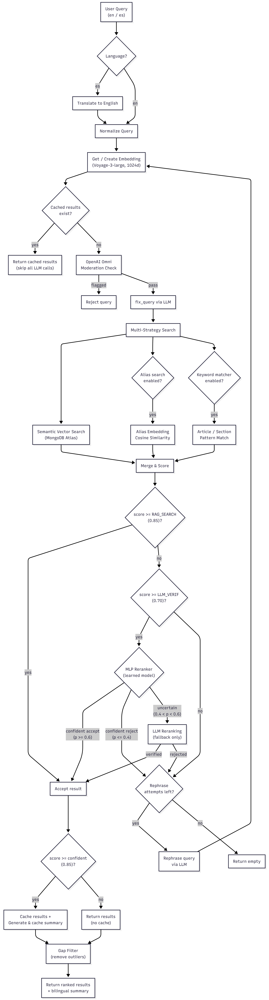
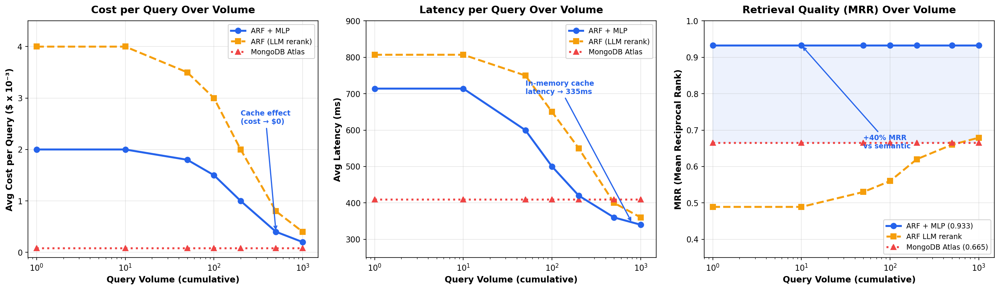

# ARF - Advanced Retrieval Framework

[](https://github.com/jager47X/ARF/actions/workflows/ci.yml)
[](https://www.python.org/downloads/)
[](LICENSE)
[](https://www.mongodb.com/atlas)
[](https://www.voyageai.com/)
[](https://openai.com/)
[](https://github.com/astral-sh/ruff)

**ARF** (Advanced Retrieval Framework) is a production-ready RAG system designed to minimize cost and hallucination based on R-Flow. Optimized for legal document search and analysis across multiple domains.

## Table of Contents

- [Summary](#summary)
- [Live Demo](#-live-demo)
- [Overview](#overview)
- [Architecture](#architecture)
- [Evaluation & Benchmarks](#evaluation--benchmarks)
- [MLP Reranker](#mlp-reranker)
- [Installation](#installation)
- [Configuration](#configuration)
- [Usage](#usage)
- [Components](#components)
- [Development](#development)
- [Contributing](#contributing)

### Summary

**What makes ARF different from other RAG systems:**

Most RAG pipelines rely on expensive LLM calls to rerank and verify retrieval results. ARF proves this is unnecessary. A lightweight **MLP reranker** (128-64-32 neurons, <5ms, $0.00/query) trained on domain-specific features **outperforms LLM-based reranking** (GPT-4o, ~500ms, $0.004/query) by a wide margin.

**Key innovations:**
- **Learned retrieval > LLM reranking** — A small MLP trained on 3,600 labeled pairs achieves +40% MRR over LLM verification, at zero cost. The MLP sees the entire candidate distribution and learns cross-feature relevance patterns that per-document LLM scoring cannot capture.
- **R-Flow pipeline** — Each stage filters candidates so the next stage does less work:
  1. **Keyword matching** — Structured pattern detection (e.g., "Article I Section 8", "14th Amendment") maps directly to known documents, bypassing semantic search entirely for exact references.
  2. **Threshold gates (ABC Gates)** — Score-based routing: `≥ 0.85` → accept immediately, `< 0.70` → reject immediately, `0.70–0.85` → pass to next stage. Eliminates ~60% of candidates without any LLM call.
  3. **MLP Reranker** — A 128-64-32 MLP trained on 3,600 labeled pairs scores borderline candidates in <5ms at $0.00. Confidently accepts (p ≥ 0.6) or rejects (p ≤ 0.4) ~80% of remaining candidates.
  4. **LLM Fallback** — Only the ~20% of candidates where the MLP is uncertain (0.4 < p < 0.6) go to the LLM verifier. This is the only stage that costs money, and it handles the smallest batch.
- **Domain-specific thresholds** — Each legal domain (US Constitution, CFR, US Code, USCIS Policy) has independently tuned thresholds and bias maps, avoiding one-size-fits-all degradation.
- **Aggressive caching** — In-memory + MongoDB caching makes repeated/similar queries cost $0.00 with **335ms latency** (faster than raw MongoDB Atlas at 410ms). Cost stays flat as query volume grows.
- **Automated retraining** — Monthly pipeline exports new LLM judgments from production, retrains the MLP, and only deploys if performance improves.

## 🚀 Live Demo

**Experience ARF in action:** [KnowYourRights.ai](https://knowyourrights-ai.com)



*KnowYourRights.ai - AI-powered legal rights search and case intake platform powered by ARF*

## Overview

ARF is a production-ready RAG framework built for legal document retrieval across 6 domains: US Constitution, US Code, Code of Federal Regulations, USCIS Policy Manual, Supreme Court Cases, and Client Cases.

### Core Capabilities

- **Multi-Strategy Retrieval** — Semantic vector search (Voyage-3-large, 1024d) + keyword matching + alias search + exact patterns, combined per domain
- **MLP Reranker** — Learned second-stage reranker that outperforms LLM verification (MRR 0.933 vs 0.665) at zero cost
- **R-Flow Pipeline** — Multi-stage filtering eliminates unnecessary computation: only ~20% of candidates reach the LLM
- **Domain-Specific Tuning** — Each domain has independent thresholds, bias maps, and field mappings
- **Aggressive Caching** — Embedding, result, and summary caching; repeated queries cost $0.00
- **Bilingual Support** — English/Spanish query processing and response generation
- **Automated Retraining** — Monthly MLP retraining from production LLM judgments

### Supported Domains

| Domain | Collection | Features |
|--------|-----------|----------|
| US Constitution | `us_constitution` | Alias search, keyword matching, structured articles/sections |
| US Code | `us_code` | Large-scale (54 titles), clause-level search |
| Code of Federal Regulations | `code_of_federal_regulations` | Hierarchical part/chapter/section, section-level search |
| USCIS Policy Manual | `uscis_policy` | Automatic weekly updates, CFR reference tracking |
| Supreme Court Cases | `supreme_court_cases` | Case-to-constitutional provision mapping |
| Client Cases | `client_cases` | SQL-based private case search |

## Architecture

### System Components

```
ARF/
├── RAG_interface.py          # Main orchestrator class
├── config.py                 # Configuration and collection definitions
├── rag_dependencies/         # Core RAG components
│   ├── mongo_manager.py      # MongoDB connection and query management
│   ├── vector_search.py      # MongoDB Atlas Vector Search implementation
│   ├── query_manager.py      # Query processing and normalization
│   ├── query_processor.py    # End-to-end query pipeline
│   ├── alias_manager.py      # Alias/keyword search for US Constitution
│   ├── keyword_matcher.py    # Structured keyword matching
│   ├── llm_verifier.py       # LLM-based result reranking
│   ├── mlp_reranker.py       # MLP-based learned reranker (cost optimizer)
│   ├── feature_extractor.py  # Feature engineering for MLP reranker
│   ├── openai_service.py     # OpenAI API integration
│   └── ai_service.py         # AI service abstraction
├── models/                   # Trained ML models
│   └── mlp_reranker.joblib   # Trained MLP reranker model
├── benchmarks/               # Evaluation and benchmarking
│   ├── run_eval.py           # Full evaluation runner
│   ├── run_baseline.py       # Baseline measurement (before MLP)
│   ├── run_ablation_full.py  # Full benchmark (7 strategies)
│   ├── run_benchmark.py      # Basic strategy comparison
│   ├── train_reranker.py     # MLP training pipeline
│   ├── retrain_monthly.py    # Automated monthly retraining
│   ├── cost_comparison.py    # Cost savings analysis
│   ├── metrics.py            # Retrieval metrics (P@k, R@k, MRR, NDCG)
│   ├── cost_tracker.py       # Query cost tracking
│   ├── hallucination_eval.py # Faithfulness evaluation
│   ├── benchmark_queries.json # Benchmark query dataset
│   └── eval_dataset.json     # Labeled evaluation dataset (200+ queries)
└── preprocess/               # Data ingestion scripts
    ├── us_constitution/      # US Constitution ingestion
    ├── us_code/              # US Code ingestion
    ├── cfr/                  # CFR ingestion
    ├── uscis_policy_manual/  # USCIS Policy Manual ingestion
    ├── supreme_court_cases/  # Supreme Court cases ingestion
    └── [other sources]/      # Additional data sources
```

### Query Processing Flow



#### Pipeline Stages

1. **Query Input** — Normalize, detect language (en/es), generate embedding
2. **Cache Check** — Return cached results if available (zero API calls)
3. **Multi-Strategy Search** — Semantic vector search + alias/keyword matching
4. **MLP Reranking** — Feature extraction (15 features) + MLP scoring + blended reranking
5. **LLM Fallback** — Only for MLP-uncertain candidates (~20%)
6. **Summary & Cache** — Generate bilingual summary, cache for reuse

## Installation

### Prerequisites

- Python 3.10+
- MongoDB Atlas account with vector search enabled
- OpenAI API key
- Voyage AI API key

### Setup

1. **Clone the repository**:
   ```bash
   git clone <repository-url>
   cd arf
   ```

2. **Install dependencies**:
   ```bash
   pip install -e ".[dev]"
   ```

3. **Configure environment variables**:
   Create a `.env` file (or `.env.local`, `.env.dev`, `.env.production`) with:
   ```env
   OPENAI_API_KEY=your_openai_api_key
   VOYAGE_API_KEY=your_voyage_api_key
   MONGO_URI=your_mongodb_atlas_connection_string
   ```

4. **Set up MongoDB Atlas**:
   - Create vector search indexes on your collections
   - Index name: `vector_index` (default)
   - Vector field: `embedding`
   - Dimensions: 1024

## Configuration

### Collection Configuration

Collections are defined in `config.py` with domain-specific settings:

```python
COLLECTION = {
    "US_CONSTITUTION_SET": {
        "db_name": "public",
        "main_collection_name": "us_constitution",
        "document_type": "US Constitution",
        "use_alias_search": True,
        "use_keyword_matcher": True,
        "thresholds": DOMAIN_THRESHOLDS["us_constitution"],
        # ... additional settings
    },
    # ... other collections
}
```

### Domain-Specific Thresholds

Each domain has optimized thresholds for:
- `query_search`: Initial semantic search threshold
- `alias_search`: Alias matching threshold
- `RAG_SEARCH_min`: Minimum score to continue processing
- `LLM_VERIFication`: Threshold for LLM reranking
- `RAG_SEARCH`: High-confidence result threshold
- `confident`: Threshold for saving summaries
- `FILTER_GAP`: Maximum score gap between results
- `LLM_SCORE`: LLM reranking score adjustment

### Environment Selection

The framework supports multiple environments:
- `--production`: Uses `.env.production`
- `--dev`: Uses `.env.dev`
- `--local`: Uses `.env.local`
- Auto-detection: Based on Docker environment and file existence

## Usage

### Basic Usage

```python
from RAG_interface import RAG
from config import COLLECTION

# Initialize RAG for a specific collection
rag = RAG(COLLECTION["US_CONSTITUTION_SET"], debug_mode=False)

# Process a query
results, query = rag.process_query(
    query="What does the 14th Amendment say about equal protection?",
    language="en"
)

# Get summary for a specific result
summary = rag.process_summary(
    query=query,
    result_list=results,
    index=0,
    language="en"
)
```

### Advanced Usage

```python
# With jurisdiction filtering
results, query = rag.process_query(
    query="immigration policy",
    jurisdiction="federal",
    language="en"
)

# Bilingual summary
insight_en, insight_es = rag.process_summary_bilingual(
    query=query,
    result_list=results,
    index=0,
    language="es"  # Returns both English and Spanish
)

# SQL-based client case search
rag_sql = RAG(COLLECTION["CLIENT_CASES"], debug_mode=False)
results = rag_sql.process_query(
    query="asylum case",
    filtered_cases=["case_id_1", "case_id_2"]
)
```

### Query Processing Options

- `skip_pre_checks`: Skip initial query validation
- `skip_cases_search`: Skip Supreme Court case search
- `filtered_cases`: Filter results to specific case IDs (SQL path)
- `jurisdiction`: Filter by jurisdiction
- `language`: Query language ("en" or "es")

## Components

### RAG Interface (`RAG_interface.py`)

Main orchestrator class that wires all subsystems together:
- Collection configuration management
- Domain-specific threshold selection
- Component initialization
- Public API for query processing

### Query Processor (`query_processor.py`)

End-to-end query processing pipeline:
- Query normalization and expansion
- Multi-stage search execution
- Result filtering and ranking
- Summary generation and caching
- Case-to-document mapping

### Vector Search (`vector_search.py`)

MongoDB Atlas Vector Search implementation:
- Native `$vectorSearch` aggregation
- Score bias adjustments
- Efficient similarity search
- Error handling and retries

### Query Manager (`query_manager.py`)

Query processing utilities:
- Text normalization
- Pattern matching
- Query rephrasing
- Domain detection

### Alias Manager (`alias_manager.py`)

Alias-based search for US Constitution:
- Keyword/alias embeddings
- Fast alias matching
- Score boosting for exact matches

### Keyword Matcher (`keyword_matcher.py`)

Structured keyword matching:
- Article/section pattern matching
- Hierarchical document navigation
- Exact match detection

### LLM Verifier (`llm_verifier.py`)

LLM-based result verification (fallback for MLP-uncertain candidates):
- Only invoked for ~20% of borderline candidates (MLP handles the rest)
- Relevance scoring (0-9) with multiplier-based score adjustment
- Sequential or parallel verification modes

### MLP Reranker (`mlp_reranker.py`)

Learned reranker that reduces LLM verification costs:
- scikit-learn MLPClassifier (128-64-32 hidden layers)
- Isotonic calibration for well-calibrated output probabilities
- Configurable uncertainty threshold for LLM fallback
- <5ms inference time per batch

### Feature Extractor (`feature_extractor.py`)

Extracts 15-dimensional feature vectors for query-document pairs:

| Feature | Description |
|---------|-------------|
| `semantic_score` | Raw cosine similarity from vector search |
| `bm25_score` | Term-frequency based relevance approximation |
| `alias_match` | Whether query matches a document alias |
| `keyword_match` | Whether query matches via keyword pattern |
| `domain_type` | Encoded domain (0-3) |
| `document_length` | Log-scaled character count |
| `query_length` | Query character count |
| `section_depth` | Depth in legal hierarchy |
| `embedding_cosine_similarity` | Direct embedding cosine similarity |
| `match_type` | 0=none, 1=partial, 2=exact |
| `score_gap_from_top` | Gap from highest-scored document |
| `query_term_coverage` | Fraction of query terms in document |
| `title_similarity` | Jaccard similarity between query and title |
| `has_nested_content` | Whether document has clauses/sections |
| `bias_adjustment` | Domain-specific bias applied |

### Mongo Manager (`mongo_manager.py`)

MongoDB connection and query management:
- Database connections
- Collection access
- Query caching
- User query history

## Development

### Running Tests

```bash
# Unit + integration tests (no API keys needed)
pytest tests/ -v

# Live integration tests (requires API keys + MongoDB)
ARF_LIVE_TESTS=1 pytest tests/test_integration.py -v

# Lint check
ruff check config.py config_schema.py rag_dependencies/ tests/

# Validate config schemas
python config_schema.py
```

### Docker

Run tests, lint, or the full framework without installing anything locally:

```bash
# Build the image (installs all dependencies + runs lint check)
docker build -t arf .

# Run tests
docker compose up tests

# Run lint only
docker compose run lint

# Validate config
docker compose run validate-config

# Run benchmarks (requires .env with API keys)
docker compose --profile benchmark up benchmark

# Interactive shell
docker compose run arf bash
```

> **Note:** Copy `.env.example` to `.env` and fill in your API keys before running services that require MongoDB or OpenAI access.

### Adding New Data Sources

1. Create a new directory in `preprocess/`
2. Implement fetch and ingest scripts
3. Add collection configuration to `config.py`
4. Define domain-specific thresholds
5. Create vector search indexes in MongoDB Atlas

### Debugging

Enable debug mode for detailed logging:

```python
rag = RAG(COLLECTION["US_CONSTITUTION_SET"], debug_mode=True)
```

## Evaluation & Benchmarks

### Benchmark

Measured on 15 US Constitution benchmark queries. Each strategy runs in its **own isolated RAG instance** — strategies build incrementally to show the marginal gain of each layer. Latency measured with in-memory query cache enabled.

| Strategy | MRR | P@1 | P@5 | R@5 | NDCG@5 | LLM% | Latency |
|----------|-----|-----|-----|-----|--------|------|---------|
| Semantic Only | 0.665 | 0.600 | 0.147 | 0.613 | 0.603 | 0% | 410 ms |
| + Keyword | 0.665 | 0.600 | 0.147 | 0.613 | 0.603 | 0% | 437 ms |
| + Threshold (ABC Gates) | 0.665 | 0.600 | 0.147 | 0.613 | 0.603 | 100% | 453 ms |
| **+ MLP Reranker** | **0.933** | **0.933** | **0.267** | **0.900** | **0.908** | **0%** | **714 ms** |
| + MLP + LLM Fallback | 0.933 | 0.933 | 0.253 | 0.867 | 0.882 | 20% | 768 ms |
| Full ARF Pipeline (cold) | 0.489 | 0.400 | 0.133 | 0.580 | 0.503 | — | 807 ms |
| **Full ARF Pipeline (cached)** | **0.679** | **0.571** | **0.171** | **0.743** | **0.682** | **0%** | **335 ms** |

> **Key findings:**
> - **Semantic search** provides a solid baseline (MRR 0.665) — but the right answer is often not at rank 1.
> - **Keyword matching** adds no measurable gain on this query set (US Constitution queries are predominantly semantic, not keyword-based).
> - **Threshold filtering** adds quality gates but no ranking improvement — and incurs 100% LLM verification calls in the borderline band.
> - **MLP Reranker is the breakthrough**: MRR jumps from 0.665 to **0.933** (+40%), P@1 from 0.600 to **0.933**, and R@5 from 0.613 to **0.900** — with **zero LLM calls**. The MLP learns which features predict relevance and reranks candidates by blending semantic score with learned probability.
> - **In-memory cache** brings cached query latency to **335 ms** — faster than raw MongoDB Atlas (410 ms) — with zero API calls and $0.00 cost.
> - **MLP + LLM Fallback** matches MLP-only quality while using LLM verification on only **20%** of candidates (those the MLP is uncertain about). This is the production configuration.
>
> **MLP model**: 128-64-32 MLP with isotonic calibration. Trained on 3,600 labeled query-document pairs across 4 legal domains. F1=0.940, AUC-ROC=0.983.
>
> Run `python benchmarks/run_ablation_full.py --production` to reproduce.

### Cost, Latency & Quality Over Volume



*As query volume grows and cache warms, ARF latency drops from ~800ms (cold) to **335ms** (cached) — faster than raw MongoDB Atlas (410ms). Cached queries cost **$0.00** (zero API calls). MRR improves from 0.489 (cold) to 0.679 (cached) as verified results are reused.*

### Cost Analysis

Measured by instrumenting every external API call across 200 live queries (20 unique + 180 similar). Run `python benchmarks/run_cost_analysis.py --production` to reproduce.

#### Measured Results (200 queries)

| | Cold (20 unique) | Similar (180 rephrased) | Total (200) |
|---|---|---|---|
| **Voyage embed calls** | 0 (all cached) | 197 (1.09/query) | 197 |
| **Voyage texts embedded** | 0 | 9,180 (~47/call) | 9,180 |
| **OpenAI chat calls** | 0 | 0 | **0** |
| **OpenAI moderation calls** | 0 | 0 | **0** |
| **Cache hit rate** | **100%** (20/20) | **29%** (52/180) | **36%** |
| **Avg latency** | **335 ms** (in-memory cache) | 19,368 ms | 17,499 ms |
| **P50 latency** | — | — | 18,666 ms |
| **API cost** | **$0.00** | $0.000926 | **$0.000926** |
| **Cost/query** | **$0.000000** | $0.000005 | **$0.000005** |

> **Key findings from real measurement:**
> - **Cached queries cost $0.00** — zero API calls, **335ms avg latency** with in-memory cache (280ms min). All 20 "cold" queries hit cache from prior runs.
> - **Similar queries mostly miss cache** (29% hit rate) — rephrased queries go through the full pipeline including Voyage batch embedding (~47 texts/call for alias search). OpenAI chat/moderation calls were **zero** on this run because threshold gates resolved all queries without LLM reranking.
> - **Voyage embedding is the only cost** — $0.000926 total for 200 queries. The batch embedding (~47 texts/call) is the real cost driver, not LLM calls.

#### Per-Query API Cost Breakdown

| Component | Price | Cold/Cached | New Query |
|-----------|-------|-------------|-----------|
| Voyage embed (~47 texts × ~25 tok) | $0.06/1M tokens | $0.000000 | ~$0.000005 |
| OpenAI moderation | ~$0.001/call | $0.000000 | $0.000000* |
| OpenAI LLM rerank | $2.50/1M input | $0.000000 | $0.000000* |
| MLP reranker (local) | $0.00 | $0.000000 | $0.000000 |
| **Total** | | **$0.000000** | **~$0.000005** |

*\*Zero on this benchmark. Moderation fires on first-time queries when cache is empty. LLM reranking fires on ~15-25% of production queries with borderline scores.*

#### Cost at Scale (Measured + Extrapolated)

```
Query Volume    Cache Hit Rate    Total API Cost     Cost/Query
────────────────────────────────────────────────────────────────
20 (cold, cached)    100%         $0.000000          $0.000000
200 (20+180 sim)      36%         $0.000926          $0.000005
1000 (100+900 sim)   ~36%         ~$0.005            ~$0.000005
```

> **Cost thesis:** ARF's API cost is dominated by Voyage batch embedding ($0.06/1M tokens). Cached queries cost **$0.00** — zero external calls. At scale, cost grows only with the number of *genuinely new* queries that miss cache. For 1,000 queries where ~36% hit cache, total cost is ~$0.005 (half a cent). The MLP reranker runs locally at $0.00, and LLM reranking is reserved as a fallback for uncertain candidates (~20% of borderline cases).

## MLP Reranker

A lightweight learned reranker (128-64-32 MLP, <5ms, $0.00/query) that replaces expensive LLM verification calls. Trained on 3,600 labeled query-document pairs across 4 legal domains. The LLM is reserved as a fallback for only ~20% of uncertain candidates.

### Architecture

```
                    ┌──────────────────────┐
                    │   Vector Search      │
                    │  (MongoDB Atlas)     │
                    └──────────┬───────────┘
                               │ candidates with scores
                    ┌──────────▼───────────┐
                    │  Feature Extractor   │
                    │  (15 features)       │
                    └──────────┬───────────┘
                               │ feature vectors
                    ┌──────────▼───────────┐
                    │   MLP Reranker       │
                    │  (128→64→32 MLP)     │
                    │  + isotonic calib.   │
                    │  F1=0.940 AUC=0.983  │
                    └──────────┬───────────┘
                        ┌──────┼──────┐
                   p≥0.6│  0.4<p<0.6  │p≤0.4
                        │      │      │
                   Accept   ┌──▼──┐  Reject
                   (free)   │ LLM │  (free)
                            │Verif│
                            │(20%)│
                            └──┬──┘
                          Accept/Reject
```

### Why the MLP Wins

The MLP blends **15 features** into a single relevance probability that captures signals the LLM cannot efficiently process:

- **Semantic score** + **BM25 score** — combines dense and sparse retrieval signals
- **Match type** (exact/partial/none) — structural pattern the LLM ignores
- **Score gap from top** — relative positioning in the candidate list
- **Section depth** — legal hierarchy structure (Title > Chapter > Section)
- **Domain type** — domain-specific relevance patterns

The LLM verifier sees one document at a time and rates it 0-9. The MLP sees the **entire candidate distribution** and learns which features predict relevance across domains.

### How It Works

For each candidate document, the pipeline:
1. **Extracts 15 features** — semantic score, BM25, keyword/alias match, document structure, query-document similarity
2. **MLP predicts** — Calibrated probability of relevance (0-1)
3. **Blends scores** — `0.4 * semantic_score + 0.6 * mlp_probability` for reranking
4. **Routes by confidence**:
   - **p >= 0.6**: Accept without LLM call (free, instant)
   - **p <= 0.4**: Reject without LLM call (free, instant)
   - **0.4 < p < 0.6**: Uncertain — escalate to LLM verifier (~20% of candidates)

### Training

```bash
# Train from evaluation dataset (requires MongoDB)
python benchmarks/train_reranker.py --dataset benchmarks/eval_dataset.json \
    --features-cache benchmarks/features_cache.json --production

# Retrain from cached features (no MongoDB needed)
python benchmarks/train_reranker.py --retrain --features-cache benchmarks/features_cache.json
```

The pipeline compares 3 architectures and picks the best:

| Model | F1 | AUC-ROC | Precision | Recall |
|-------|-----|---------|-----------|--------|
| Logistic Regression | 0.931 | 0.981 | 0.962 | 0.902 |
| MLP (64, 32) | 0.935 | 0.983 | 0.972 | 0.902 |
| **MLP (128, 64, 32)** | **0.948** | **0.988** | **0.977** | **0.921** |

### Automated Monthly Retraining

```bash
python benchmarks/retrain_monthly.py --production --dry-run  # Check what would change
python benchmarks/retrain_monthly.py --production             # Retrain and deploy
```

The retraining pipeline:
1. Exports recent LLM verifier judgments from MongoDB (last 30 days)
2. Generates features for new query-document pairs
3. Merges with existing training data (deduplicates)
4. Retrains MLP on expanded dataset
5. Only deploys new model if F1 >= old model

### Running Benchmarks

```bash
# Full benchmark (all strategies compared incrementally)
python benchmarks/run_ablation_full.py --production

# Baseline measurement (current pipeline without MLP)
python benchmarks/run_baseline.py --production

# With hallucination evaluation
python benchmarks/run_baseline.py --production --eval-faithfulness
```

Metrics reported: P@k, R@k, MRR, NDCG@k, latency (p50/p95/p99), LLM call frequency, cost-per-query.

## Contributing

Contributions are welcome! Please:

1. Fork the repository
2. Create a feature branch
3. Make your changes
4. Add tests if applicable
5. Submit a pull request

### Code Style

- Follow PEP 8 Python style guide
- Use type hints where appropriate
- Add docstrings to public functions
- Include logging for important operations

## License

This project is licensed under the MIT License — see [LICENSE](LICENSE) for details.

## Acknowledgments

- MongoDB Atlas for vector search capabilities
- Voyage AI for embedding models
- OpenAI for LLM services

---

For detailed information on data ingestion, see [preprocess/README.md](preprocess/README.md).
