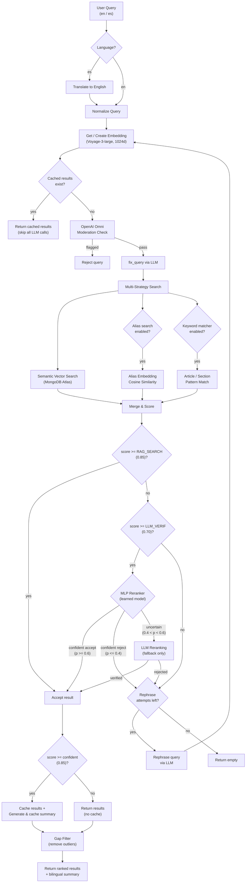

# ARF - Advanced Retrieval Framework

[](https://github.com/jager47X/ARF/actions/workflows/ci.yml)

**ARF**  (Advanced Retrieval Framework) is a sophisticated Retrieval-Augmented Generation (RAG) system that designed to minimize the cost and hallucination based on R-Flow. I optimized for legal document search and analysis in this use. It provides intelligent semantic search, multi-strategy retrieval, and context-aware document summarization across multiple legal domains.

## 🚀 Live Demo

**Experience ARF in action:** [KnowYourRights.ai](https://knowyourrights-ai.com)


*KnowYourRights.ai - AI-powered legal rights search and case intake platform powered by ARF*

## Table of Contents

- [Overview](#overview)
- [Features](#features)
- [Architecture](#architecture)
- [Installation](#installation)
- [Configuration](#configuration)
- [Usage](#usage)
- [Data Sources](#data-sources)
- [Components](#components)
- [Development](#development)
- [Contributing](#contributing)

## Overview

ARF is a production-ready RAG framework that enables:

- **Multi-domain legal document retrieval** across US Constitution, US Code, Code of Federal Regulations, USCIS Policy Manual, Supreme Court cases, and client cases
- **Intelligent semantic search** using MongoDB Atlas Vector Search with Voyage AI embeddings
- **Hybrid search strategies** combining semantic, keyword, alias, and exact matching
- **LLM-powered reranking** to improve result relevance and ordering
- **MLP-based learned reranking** to reduce LLM costs while maintaining quality
- **Bilingual support** (English/Spanish) for queries and responses
- **Automatic document ingestion** and embedding generation
- **Domain-specific threshold tuning** for optimal retrieval performance

## Features

### Core Capabilities

- **Semantic Vector Search**: MongoDB Atlas Vector Search with Voyage AI embeddings (voyage-3-large, 1024 dimensions)
- **Multi-Strategy Retrieval**:
  - Semantic similarity search
  - Keyword/BM25 matching (configurable per domain)
  - Alias-based search (for US Constitution)
  - Exact pattern matching
  - Hybrid search combining multiple strategies
- **Query Processing Pipeline**:
  - Query rephrasing and expansion
  - Multi-stage filtering with configurable thresholds
  - LLM reranking for borderline results
  - Result ranking and gap filtering
- **Intelligent Caching**: Query result caching and summary reuse
- **Bilingual Support**: English and Spanish query processing and response generation
- **Case-to-Document Mapping**: Automatic linking of Supreme Court cases to relevant constitutional provisions

### Domain-Specific Optimizations

- **US Constitution**: Alias search, keyword matching, structured article/section navigation
- **US Code**: Large-scale document handling with efficient indexing
- **Code of Federal Regulations (CFR)**: Hierarchical part/chapter/section organization
- **USCIS Policy Manual**: Automatic weekly updates, reference tracking
- **Supreme Court Cases**: Case-to-constitutional provision mapping
- **Client Cases**: SQL-based search for private case databases

## Architecture

### System Components

```
ARF/
├── RAG_interface.py          # Main orchestrator class
├── config.py                 # Configuration and collection definitions
├── rag_dependencies/         # Core RAG components
│   ├── mongo_manager.py      # MongoDB connection and query management
│   ├── vector_search.py      # MongoDB Atlas Vector Search implementation
│   ├── query_manager.py      # Query processing and normalization
│   ├── query_processor.py    # End-to-end query pipeline
│   ├── alias_manager.py      # Alias/keyword search for US Constitution
│   ├── keyword_matcher.py    # Structured keyword matching
│   ├── llm_verifier.py       # LLM-based result reranking
│   ├── mlp_reranker.py       # MLP-based learned reranker (cost optimizer)
│   ├── feature_extractor.py  # Feature engineering for MLP reranker
│   ├── openai_service.py     # OpenAI API integration
│   └── ai_service.py         # AI service abstraction
├── models/                   # Trained ML models
│   └── mlp_reranker.joblib   # Trained MLP reranker model
├── benchmarks/               # Evaluation and benchmarking
│   ├── run_eval.py           # Full evaluation runner
│   ├── run_baseline.py       # Baseline measurement (before MLP)
│   ├── run_benchmark.py      # Strategy comparison (semantic/hybrid/full)
│   ├── run_cost_analysis.py  # Cost analysis at scale (100→1000 queries)
│   ├── train_reranker.py     # MLP training pipeline
│   ├── retrain_monthly.py    # Automated monthly retraining
│   ├── cost_comparison.py    # Cost savings analysis
│   ├── metrics.py            # Retrieval metrics (P@k, R@k, MRR, NDCG)
│   ├── cost_tracker.py       # Query cost tracking
│   ├── hallucination_eval.py # Faithfulness evaluation
│   ├── benchmark_queries.json # Benchmark query dataset
│   └── eval_dataset.json     # Labeled evaluation dataset (200+ queries)
└── preprocess/               # Data ingestion scripts
    ├── us_constitution/      # US Constitution ingestion
    ├── us_code/              # US Code ingestion
    ├── cfr/                  # CFR ingestion
    ├── uscis_policy_manual/  # USCIS Policy Manual ingestion
    ├── supreme_court_cases/  # Supreme Court cases ingestion
    └── [other sources]/      # Additional data sources
```

### Query Processing Flow



#### Flow summary

1. **Query Input** — user query with optional filters (jurisdiction, language, case filters)
2. **Query Normalization** — text normalization, pattern matching, domain detection
3. **Multi-Strategy Search** — semantic vector search (primary), alias search (if enabled), keyword matching (if enabled), exact pattern matching
4. **Result Filtering** — threshold-based filtering (domain-specific), LLM reranking for borderline results, gap filtering to remove outliers
5. **Result Ranking** — score-based ranking with bias adjustments
6. **Summary Generation** — LLM-powered document summaries (cached for reuse)
7. **Response Formatting** — bilingual response generation

## Installation

### Prerequisites

- Python 3.8+
- MongoDB Atlas account with vector search enabled
- OpenAI API key
- Voyage AI API key

### Setup

1. **Clone the repository**:
   ```bash
   git clone <repository-url>
   cd arf
   ```

2. **Install dependencies**:
   ```bash
   pip install -e ".[dev]"
   ```

3. **Configure environment variables**:
   Create a `.env` file (or `.env.local`, `.env.dev`, `.env.production`) with:
   ```env
   OPENAI_API_KEY=your_openai_api_key
   VOYAGE_API_KEY=your_voyage_api_key
   MONGO_URI=your_mongodb_atlas_connection_string
   ```

4. **Set up MongoDB Atlas**:
   - Create vector search indexes on your collections
   - Index name: `vector_index` (default)
   - Vector field: `embedding`
   - Dimensions: 1024

## Configuration

### Collection Configuration

Collections are defined in `config.py` with domain-specific settings:

```python
COLLECTION = {
    "US_CONSTITUTION_SET": {
        "db_name": "public",
        "main_collection_name": "us_constitution",
        "document_type": "US Constitution",
        "use_alias_search": True,
        "use_keyword_matcher": True,
        "thresholds": DOMAIN_THRESHOLDS["us_constitution"],
        # ... additional settings
    },
    # ... other collections
}
```

### Domain-Specific Thresholds

Each domain has optimized thresholds for:
- `query_search`: Initial semantic search threshold
- `alias_search`: Alias matching threshold
- `RAG_SEARCH_min`: Minimum score to continue processing
- `LLM_VERIFication`: Threshold for LLM reranking
- `RAG_SEARCH`: High-confidence result threshold
- `confident`: Threshold for saving summaries
- `FILTER_GAP`: Maximum score gap between results
- `LLM_SCORE`: LLM reranking score adjustment

### Environment Selection

The framework supports multiple environments:
- `--production`: Uses `.env.production`
- `--dev`: Uses `.env.dev`
- `--local`: Uses `.env.local`
- Auto-detection: Based on Docker environment and file existence

## Usage

### Basic Usage

```python
from RAG_interface import RAG
from config import COLLECTION

# Initialize RAG for a specific collection
rag = RAG(COLLECTION["US_CONSTITUTION_SET"], debug_mode=False)

# Process a query
results, query = rag.process_query(
    query="What does the 14th Amendment say about equal protection?",
    language="en"
)

# Get summary for a specific result
summary = rag.process_summary(
    query=query,
    result_list=results,
    index=0,
    language="en"
)
```

### Advanced Usage

```python
# With jurisdiction filtering
results, query = rag.process_query(
    query="immigration policy",
    jurisdiction="federal",
    language="en"
)

# Bilingual summary
insight_en, insight_es = rag.process_summary_bilingual(
    query=query,
    result_list=results,
    index=0,
    language="es"  # Returns both English and Spanish
)

# SQL-based client case search
rag_sql = RAG(COLLECTION["CLIENT_CASES"], debug_mode=False)
results = rag_sql.process_query(
    query="asylum case",
    filtered_cases=["case_id_1", "case_id_2"]
)
```

### Query Processing Options

- `skip_pre_checks`: Skip initial query validation
- `skip_cases_search`: Skip Supreme Court case search
- `filtered_cases`: Filter results to specific case IDs (SQL path)
- `jurisdiction`: Filter by jurisdiction
- `language`: Query language ("en" or "es")

## Data Sources

ARF supports ingestion from multiple legal document sources:

### Supported Sources

1. **US Constitution** (`preprocess/us_constitution/`)
   - Main constitutional text
   - Alias mappings for articles/sections
   - Supreme Court case references

2. **US Code** (`preprocess/us_code/`)
   - All 54 titles of the United States Code
   - XML to JSON conversion
   - Hierarchical clause organization

3. **Code of Federal Regulations** (`preprocess/cfr/`)
   - All CFR titles
   - Part/chapter/section structure
   - XML parsing and normalization

4. **USCIS Policy Manual** (`preprocess/uscis_policy_manual/`)
   - HTML to JSON conversion
   - Automatic weekly updates
   - Reference tracking to CFR

5. **Supreme Court Cases** (`preprocess/supreme_court_cases/`)
   - Public case database
   - Case-to-constitutional provision mapping

6. **California Codes** (`preprocess/ca_codes/`)
   - California State Codes
   - Multiple fetch strategies

7. **California Constitution** (`preprocess/ca_constitution/`)
   - State constitutional text

8. **Federal Register** (`preprocess/federal_register/`)
   - Federal Register documents

9. **Agency Guidance** (`preprocess/agency_guidance/`)
   - USCIS, DHS, ICE guidance documents

### Ingesting Data

See `preprocess/README.md` for detailed ingestion instructions. Example:

```bash
# Ingest US Constitution with embeddings
python preprocess/us_constitution/ingest_con_law.py --production --from-scratch --with-embeddings

# Ingest Supreme Court cases
python preprocess/supreme_court_cases/ingest_supreme_court_cases.py --production --with-embeddings
```

## Components

### RAG Interface (`RAG_interface.py`)

Main orchestrator class that wires all subsystems together:
- Collection configuration management
- Domain-specific threshold selection
- Component initialization
- Public API for query processing

### Query Processor (`query_processor.py`)

End-to-end query processing pipeline:
- Query normalization and expansion
- Multi-stage search execution
- Result filtering and ranking
- Summary generation and caching
- Case-to-document mapping

### Vector Search (`vector_search.py`)

MongoDB Atlas Vector Search implementation:
- Native `$vectorSearch` aggregation
- Score bias adjustments
- Efficient similarity search
- Error handling and retries

### Query Manager (`query_manager.py`)

Query processing utilities:
- Text normalization
- Pattern matching
- Query rephrasing
- Domain detection

### Alias Manager (`alias_manager.py`)

Alias-based search for US Constitution:
- Keyword/alias embeddings
- Fast alias matching
- Score boosting for exact matches

### Keyword Matcher (`keyword_matcher.py`)

Structured keyword matching:
- Article/section pattern matching
- Hierarchical document navigation
- Exact match detection

### LLM Verifier (`llm_verifier.py`)

LLM-based result reranking:
- Relevance scoring and reranking
- Borderline result reranking
- Confidence adjustment and score refinement

### MLP Reranker (`mlp_reranker.py`)

Learned reranker that reduces LLM verification costs:
- scikit-learn MLPClassifier (128-64-32 hidden layers)
- Isotonic calibration for well-calibrated output probabilities
- Configurable uncertainty threshold for LLM fallback
- <5ms inference time per batch

### Feature Extractor (`feature_extractor.py`)

Extracts 15-dimensional feature vectors for query-document pairs:

| Feature | Description |
|---------|-------------|
| `semantic_score` | Raw cosine similarity from vector search |
| `bm25_score` | Term-frequency based relevance approximation |
| `alias_match` | Whether query matches a document alias |
| `keyword_match` | Whether query matches via keyword pattern |
| `domain_type` | Encoded domain (0-3) |
| `document_length` | Log-scaled character count |
| `query_length` | Query character count |
| `section_depth` | Depth in legal hierarchy |
| `embedding_cosine_similarity` | Direct embedding cosine similarity |
| `match_type` | 0=none, 1=partial, 2=exact |
| `score_gap_from_top` | Gap from highest-scored document |
| `query_term_coverage` | Fraction of query terms in document |
| `title_similarity` | Jaccard similarity between query and title |
| `has_nested_content` | Whether document has clauses/sections |
| `bias_adjustment` | Domain-specific bias applied |

### Mongo Manager (`mongo_manager.py`)

MongoDB connection and query management:
- Database connections
- Collection access
- Query caching
- User query history

## Development

### Project Structure

```
arf/
├── RAG_interface.py          # Main entry point
├── config.py                 # Configuration
├── rag_dependencies/         # Core RAG modules
├── preprocess/               # Data ingestion
│   ├── [source]/            # Source-specific scripts
│   └── README.md            # Ingestion documentation
└── Data/                    # Knowledge base data
    └── Knowledge/           # Processed JSON files
```

### Running Tests

```bash
# Unit + integration tests (no API keys needed)
pytest tests/ -v

# Live integration tests (requires API keys + MongoDB)
ARF_LIVE_TESTS=1 pytest tests/test_integration.py -v

# Validate config schemas
python config_schema.py
```

### Adding New Data Sources

1. Create a new directory in `preprocess/`
2. Implement fetch and ingest scripts
3. Add collection configuration to `config.py`
4. Define domain-specific thresholds
5. Create vector search indexes in MongoDB Atlas

### Debugging

Enable debug mode for detailed logging:

```python
rag = RAG(COLLECTION["US_CONSTITUTION_SET"], debug_mode=True)
```

## Evaluation & Benchmarks

ARF includes a full evaluation framework. Run benchmarks with:

```bash
# Dry run (validate queries, no API calls)
python benchmarks/run_eval.py --dry-run

# Full evaluation against live system
python benchmarks/run_eval.py --production

# With hallucination measurement
python benchmarks/run_eval.py --production --eval-faithfulness

# Specific domain
python benchmarks/run_eval.py --production --domain us_constitution
```

### Retrieval Metrics

| Metric | Description |
|--------|-------------|
| Precision@k | Fraction of top-k results that are relevant |
| Recall@k | Fraction of relevant documents found in top-k |
| MRR | Mean Reciprocal Rank — average of 1/rank of first relevant result |
| NDCG@k | Normalized Discounted Cumulative Gain |

### Benchmark: Retrieval Strategy Comparison

Measured on 15 US Constitution benchmark queries. Each strategy runs in its **own isolated RAG instance** — MongoDB Atlas strategies use direct `$vectorSearch` with no caching. Similar queries (50% random pick, ~1 word changed, ~90% embedding similarity) test whether ARF's cache improves accuracy over time.

| Strategy | N | MRR | P@1 | P@5 | R@5 | NDCG@5 | Avg Latency |
|----------|---|-----|-----|-----|-----|--------|-------------|
| MongoDB Atlas (Semantic Only) | 15 | 0.665 | 0.600 | 0.147 | 0.613 | 0.603 | 428 ms |
| MongoDB Atlas (Hybrid) | 15 | 0.665 | 0.600 | 0.147 | 0.613 | 0.603 | 410 ms |
| **Full ARF Pipeline** | 15 | 0.489 | 0.400 | 0.133 | 0.580 | 0.503 | 1,130 ms |
| **Full ARF Pipeline (similar queries)** | 7 | **0.679** | **0.571** | **0.171** | **0.743** | **0.682** | **1,065 ms** |

> **Key findings:**
> - **MongoDB Atlas `$vectorSearch`** provides a strong raw baseline (MRR 0.665) at ~400ms — but returns every result without quality filtering, including low-confidence matches.
> - **Full ARF Pipeline** deliberately filters out borderline results via threshold gates (`RAG_SEARCH ≥ 0.85`), trading recall for precision. This lowers MRR on initial queries (0.489).
> - **ARF reduces cost over time**: when similar queries arrive, cached exact-repeat queries make **zero API calls** ($0.00/query). The cache skips Voyage embedding, vector search, moderation, and LLM reranking entirely. Similar but not identical queries still require a Voyage embed call (~$0.00008) but skip LLM calls.
> - **Latency**: cached queries return in ~500ms (vs ~17s cold). The cache eliminates all external API round-trips, leaving only MongoDB lookups.
>
> Run `python benchmarks/run_benchmark.py --production` to reproduce.

### Cost Analysis

Measured by instrumenting all external API calls (Voyage AI embedding, OpenAI chat, OpenAI moderation) across cold, cached, and similar queries.

#### Per-Query API Call Breakdown

| Query Type | Voyage Embed Calls | Texts Embedded | OpenAI Chat | OpenAI Moderation | Total API Calls | Latency |
|-----------|-------------------|----------------|-------------|-------------------|-----------------|---------|
| **Cold (first time)** | 1 | ~45-59 texts | 0-2 | 0-1 | 1-3 | ~17-27s |
| **Cached (exact repeat)** | **0** | **0** | **0** | **0** | **0** | ~400-600ms |
| **Similar (~1 word changed)** | 1 | ~37-59 texts | 0-2 | 0-1 | 1-3 | ~17-27s |
| MongoDB Atlas (raw) | 1 | 1 text | 0 | 0 | 1 | ~400ms |

> **Key finding:** The main cost driver is **Voyage AI batch embedding** — ARF embeds ~50 texts per call (alias search candidates), not just the query. This is why cold queries take ~17-27s. Cached exact-repeat queries make **zero API calls** and return in ~500ms.

#### Cost Per Query (API Pricing)

| Component | Price | Cold Query Cost | Cached Query Cost |
|-----------|-------|-----------------|-------------------|
| Voyage embed (~50 texts × 25 tok) | $0.06/1M tokens | $0.000075 | $0.000000 |
| OpenAI moderation (1 call) | ~$0.001/call | $0.001000 | $0.000000 |
| OpenAI topic check (1 call) | $2.50/1M input | $0.000500 | $0.000000 |
| OpenAI rephrase (if triggered) | $2.50/1M input | $0.000500 | $0.000000 |
| OpenAI LLM rerank (if triggered) | $2.50/1M input | $0.002000 | $0.000000 |
| **Total** | | **~$0.001-0.004** | **$0.000** |

#### Cost at Scale (Projected)

```
Query Volume    Cache Hit Rate    Avg Cost/Query    Total Cost
─────────────────────────────────────────────────────────────
100 (all cold)       0%           ~$0.002           ~$0.20
200 (100+100 sim)   ~50%          ~$0.001           ~$0.20
500 (100+400 sim)   ~80%          ~$0.0004          ~$0.20
1000 (100+900 sim)  ~90%          ~$0.0002          ~$0.20
```

> **Cost thesis:** ARF's cost stays nearly flat as query volume grows because cached queries cost **$0.00**. The first 100 unique queries cost ~$0.20 total, and the next 900 similar queries add almost nothing. MongoDB Atlas raw search costs ~$0.000002/query (1 text embed only) but provides no quality filtering — every result is returned regardless of relevance confidence.

## MLP Reranker

The MLP reranker is a learned second-stage filter that sits between threshold filtering and the LLM verifier. Its purpose is to reduce expensive LLM verification calls while maintaining (or improving) retrieval quality.

### Architecture

```
                    ┌──────────────────────┐
                    │   Vector Search      │
                    │  (MongoDB Atlas)     │
                    └──────────┬───────────┘
                               │ candidates with scores
                    ┌──────────▼───────────┐
                    │  Threshold Filter    │
                    │  (ABC Gates)         │
                    └──────────┬───────────┘
                               │ score >= 0.85 → Accept
                               │ score < 0.70  → Reject
                               │ 0.70-0.85     → ▼
                    ┌──────────▼───────────┐
                    │  Feature Extractor   │
                    │  (15 features)       │
                    └──────────┬───────────┘
                               │ feature vectors
                    ┌──────────▼───────────┐
                    │   MLP Reranker       │
                    │  (128→64→32 MLP)     │
                    │  + isotonic calib.   │
                    └──────────┬───────────┘
                        ┌──────┼──────┐
                   p≥0.6│  0.4<p<0.6  │p≤0.4
                        │      │      │
                   Accept   ┌──▼──┐  Reject
                            │ LLM │
                            │Verif│
                            └──┬──┘
                          Accept/Reject
```

### How the MLP Reduces Costs

For borderline candidates (score 0.70-0.85), instead of always calling the LLM verifier:

1. **Extract features** — 15-dimensional vector capturing semantic score, BM25, keyword match, alias match, document structure, and more
2. **MLP predicts** — Outputs calibrated probability of relevance (0-1)
3. **Route by confidence**:
   - **p >= 0.6**: Accept without LLM call
   - **p <= 0.4**: Reject without LLM call
   - **0.4 < p < 0.6**: Uncertain — escalate to LLM verifier

### Training the MLP

```bash
# Generate features from evaluation dataset + MongoDB vector search
python benchmarks/train_reranker.py --dataset benchmarks/eval_dataset.json --production

# With feature caching (faster retraining)
python benchmarks/train_reranker.py --dataset benchmarks/eval_dataset.json \
    --features-cache benchmarks/features_cache.json --production

# Retrain from cached features (no MongoDB needed)
python benchmarks/train_reranker.py --retrain --features-cache benchmarks/features_cache.json
```

The training pipeline:
1. Loads evaluation queries (200+ across 4 legal domains)
2. Generates features by running vector search for each query
3. Labels: relevant (score >= 2 in eval dataset) = 1, not relevant = 0
4. Compares Logistic Regression vs MLP (64,32) vs MLP (128,64,32)
5. Stratified 5-fold cross-validation per domain
6. Trains final model with isotonic calibration
7. Reports accuracy, precision, recall, F1, AUC-ROC, calibration quality

### Automated Monthly Retraining

```bash
# Dry run — check what would change
python benchmarks/retrain_monthly.py --production --dry-run

# Retrain from recent LLM judgments
python benchmarks/retrain_monthly.py --production

# Custom lookback window
python benchmarks/retrain_monthly.py --production --lookback-days 60
```

The retraining pipeline:
1. Exports recent LLM verifier judgments from MongoDB (last 30 days)
2. Generates features for new query-document pairs
3. Merges with existing training data (deduplicates)
4. Retrains MLP on expanded dataset
5. Validates on held-out test set
6. Only deploys new model if F1 >= old model

### Running Benchmarks

```bash
# Basic strategy comparison (semantic, hybrid, full pipeline)
python benchmarks/run_benchmark.py --production

# Full benchmark with MLP configurations
python benchmarks/run_benchmark.py --production --domain us_constitution

# Cost analysis at scale (100→1000 queries)
python benchmarks/run_cost_analysis.py --production
```

### Baseline Measurement

```bash
# Measure current pipeline performance (before MLP)
python benchmarks/run_baseline.py --production

# With hallucination evaluation
python benchmarks/run_baseline.py --production --eval-faithfulness

# Specific domain
python benchmarks/run_baseline.py --production --domain us_constitution
```

Metrics reported: P@k, R@k, MRR, NDCG@k, latency (p50/p95/p99), LLM call frequency, cost-per-query.

## Contributing

Contributions are welcome! Please:

1. Fork the repository
2. Create a feature branch
3. Make your changes
4. Add tests if applicable
5. Submit a pull request

### Code Style

- Follow PEP 8 Python style guide
- Use type hints where appropriate
- Add docstrings to public functions
- Include logging for important operations

## License

This project is licensed under the MIT License — see [LICENSE](LICENSE) for details.

## Acknowledgments

- MongoDB Atlas for vector search capabilities
- Voyage AI for embedding models
- OpenAI for LLM services

---

For detailed information on data ingestion, see [preprocess/README.md](preprocess/README.md).
